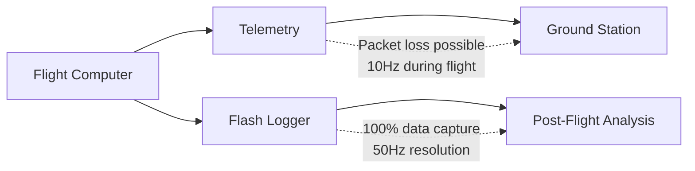
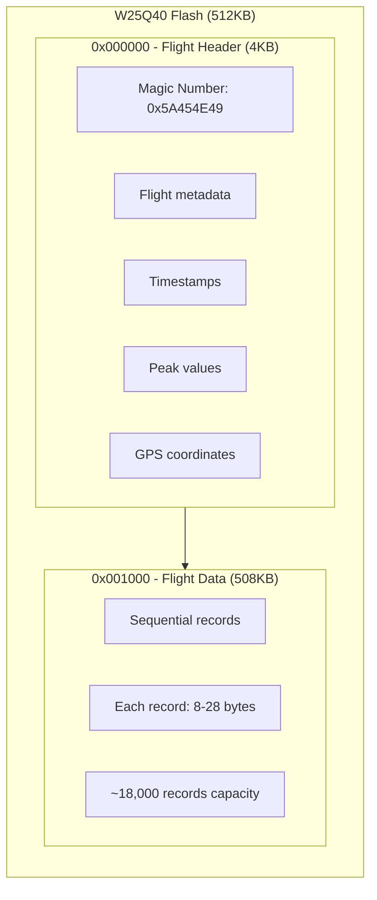
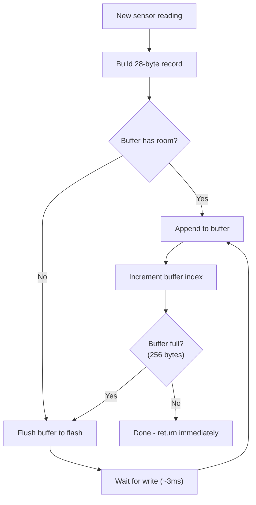
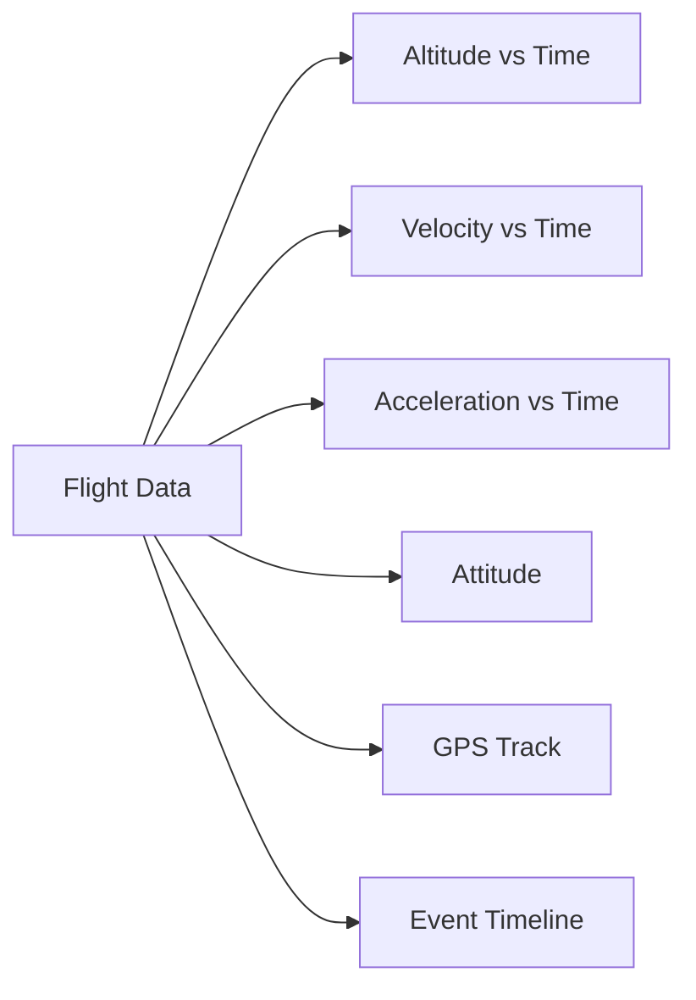
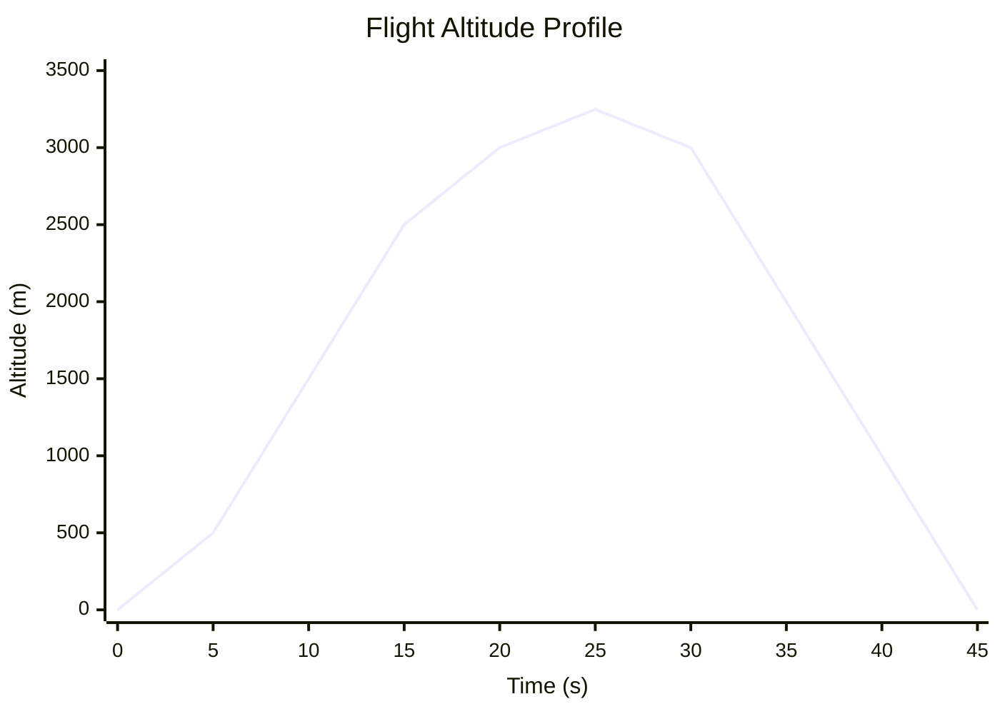

# Data Logging

This page documents the high-speed flight data recording system that writes to W25Q flash memory. This is the rocket's "black box" - the definitive record of what happened during flight.

---

## Why Flash Logging?

We have three ways to get data off the rocket:

| Method | Pros | Cons |
|--------|------|------|
| **Telemetry** | Real-time, immediate | Packet loss, limited bandwidth (10Hz max) |
| **SD Card** | Large capacity, easy to read | FAT32 overhead, vibration sensitive, slow random access |
| **Flash Memory** | Fast, reliable, simple, deterministic timing | Limited capacity (512KB) |

### Why We Use Flash for the Black Box

1. **Reliability**: SPI flash has no moving parts. SD card slots can fail under vibration.

2. **Deterministic timing**: Flash writes take ~3ms. SD writes can take 100ms+ when FAT32 decides to reorganize.

3. **Simplicity**: No filesystem needed. We just write bytes to addresses.

4. **Power loss tolerance**: Each record is self-contained. A power loss might lose the last record, but previous records are safe.

### The Role of Each System



**Telemetry** is for real-time monitoring: "Is the rocket OK right now?"

**Flash logging** is for post-flight analysis: "What exactly happened at T+24.156s?"

---

## Memory Layout

The W25Q40 has 512KB of storage. We divide it into two regions:



### Why This Layout?

**Header at start (4KB):**
- Always at known location (address 0)
- Quick to find and read after recovery
- Contains summary of entire flight
- Written once at end of flight

**Data following header:**
- Sequential writes are fastest on flash
- No need to seek or manage free space
- Records are self-describing (type byte)

### Address Map

| Address Range | Size | Purpose |
|---------------|------|---------|
| 0x000000 - 0x000FFF | 4 KB | Flight header (summary) |
| 0x001000 - 0x07FFFF | 508 KB | Flight data (records) |

---

## Flight Header

Written once at the end of the flight. Contains a complete summary.

```c
typedef struct __attribute__((packed)) {
    // Identification
    uint32_t magic;             // 0x5A454E49 ("ZENI" in ASCII)
    uint32_t version;           // Logger version (for compatibility)
    uint32_t flight_number;     // Auto-incremented each flight
    
    // Timestamps (milliseconds from boot)
    uint32_t boot_time;         // When did we boot? (always 0)
    uint32_t launch_time;       // When was launch detected?
    uint32_t apogee_time;       // When was apogee detected?
    uint32_t drogue_time;       // When did drogue fire?
    uint32_t main_time;         // When did main fire?
    uint32_t landed_time;       // When was landing detected?
    
    // Peak values (for quick reference)
    int32_t max_altitude_cm;    // Peak altitude in centimeters
    int32_t max_velocity_cms;   // Peak velocity in cm/s
    int32_t max_accel_cmss;     // Peak acceleration in cm/s²
    
    // Ground reference (for altitude calculation)
    int32_t ground_altitude_cm; // Ground level in cm MSL
    uint32_t ground_pressure;   // Ground pressure in Pa
    int16_t ground_temp;        // Ground temperature in 0.1°C
    
    // GPS coordinates (for recovery)
    int32_t launch_lat;         // Launch latitude * 1e7
    int32_t launch_lon;         // Launch longitude * 1e7
    int32_t landing_lat;        // Landing latitude * 1e7
    int32_t landing_lon;        // Landing longitude * 1e7
    
    // Data pointers
    uint32_t data_start;        // Address of first record
    uint32_t data_end;          // Address after last record
    uint32_t record_count;      // Total number of records
    
    // Integrity
    uint32_t reserved[8];       // Future expansion
    uint16_t crc;               // Header checksum
} LogHeader_t;                  // Total: ~120 bytes
```

### Magic Number Explained

The magic number `0x5A454E49` serves two purposes:

1. **Identification**: Quickly check if flash contains valid flight data
2. **Endianness check**: The bytes spell "ZENI" in ASCII (our project codename)

```c
bool IsValidHeader(LogHeader_t *header) {
    if (header->magic != 0x5A454E49) {
        return false;  // Not our data, or flash is blank
    }
    
    // Also verify CRC
    uint16_t calc_crc = CRC16((uint8_t*)header, sizeof(LogHeader_t) - 2);
    return (calc_crc == header->crc);
}
```

---

## Record Types

All records start with a magic byte (0xAB) and type byte. This allows the reader to:
1. Detect corruption (magic byte wrong)
2. Know how many bytes to read (type determines size)
3. Skip unknown record types (future compatibility)

### Sensor Record (28 bytes)

The main data record, logged at 50Hz during flight.

```c
typedef struct __attribute__((packed)) {
    uint8_t  magic;         // 0xAB - Record marker
    uint8_t  type;          // 0x01 - Sensor record
    uint16_t timestamp;     // ms since launch (wraps at 65535)
    
    int32_t altitude;       // cm AGL (±21km range)
    int16_t velocity;       // cm/s (±327 m/s range)
    int16_t accel;          // cm/s² (±327 m/s² range)
    
    int16_t roll;           // degrees * 10 (±3276°)
    int16_t pitch;          // degrees * 10
    int16_t yaw;            // degrees * 10
    
    int16_t accel_x;        // mg (±32g range)
    int16_t accel_y;        // mg
    int16_t accel_z;        // mg
    
    uint8_t state;          // Flight state enum
    uint8_t flags;          // Status flags
} LogSensorRecord_t;        // Total: 28 bytes
```

**Why 16-bit timestamp?**
- Full 32-bit would add 2 bytes per record × 9000 records = 18KB wasted
- 16-bit wraps at 65.535 seconds
- For longer flights, we can detect wrap by watching for timestamp going backwards

**Why centimeters?**
- Gives us 0.01m resolution
- int32_t range: ±21km (enough for any rocket)
- Easy mental conversion: divide by 100 for meters

### GPS Record (24 bytes)

Logged at 1Hz when GPS has fix.

```c
typedef struct __attribute__((packed)) {
    uint8_t  magic;         // 0xAB
    uint8_t  type;          // 0x02 - GPS record
    uint16_t timestamp;     // ms since launch
    
    int32_t latitude;       // degrees * 1e7
    int32_t longitude;      // degrees * 1e7
    int32_t altitude;       // mm MSL
    
    uint16_t speed;         // cm/s ground speed
    int16_t heading;        // degrees * 10
    
    uint8_t satellites;     // Number of satellites
    uint8_t fix;            // Fix type (0/1/2/3)
    uint16_t reserved;
} LogGPSRecord_t;           // Total: 24 bytes
```

### Event Record (8 bytes)

Logged on state transitions and important events.

```c
typedef struct __attribute__((packed)) {
    uint8_t  magic;         // 0xAB
    uint8_t  type;          // 0x03 - Event record
    uint16_t timestamp;     // ms since launch
    
    uint8_t event;          // Event type (see table)
    uint8_t data;           // Event-specific data
    int16_t altitude;       // Altitude at event time
} LogEventRecord_t;         // Total: 8 bytes
```

**Event Types:**

| Code | Event | data field contains |
|------|-------|---------------------|
| 0x01 | LAUNCH | Peak G during detection |
| 0x02 | BURNOUT | Duration of burn (0.1s units) |
| 0x03 | APOGEE | Velocity at detection (m/s) |
| 0x04 | DROGUE_FIRE | 0 |
| 0x05 | MAIN_FIRE | 0 |
| 0x06 | LANDED | Time since main (seconds) |
| 0x10 | SENSOR_FAIL | Sensor ID |
| 0x11 | PYRO_CONT_FAIL | Channel |
| 0xFF | ERROR | Error code |

---

## Write Strategy

### The Challenge

Flash memory has a constraint: **you can only change bits from 1 to 0**. To change 0 back to 1, you must erase an entire sector (4KB minimum).

This means:
- We can't just overwrite old data
- We must erase before reusing space
- Erasing takes time (~50ms) and can't happen during flight

### Our Solution: Write-Once, Erase-Before-Flight

1. **Before launch**: Erase all data sectors
2. **During flight**: Write sequentially, never erasing
3. **After landing**: Header is written to pre-erased header sector

```c
void DataLogger_PrepareForFlight(DataLogger_t *logger) {
    // Erase all data sectors (128 sectors × 4KB = 512KB)
    for (uint32_t sector = 0; sector < 128; sector++) {
        W25Q_SectorErase(logger->flash, sector * 4096);
        // Each erase takes ~50ms
        // Total: ~6.4 seconds
    }
    
    logger->write_addr = 0x001000;  // First data address
    logger->record_count = 0;
    logger->prepared = true;
}
```

**Why erase before flight?**
- Erasing during flight would cause 50ms delays (unacceptable)
- Pre-flight we have plenty of time
- Adds to pre-launch checklist: "Is flash erased? Yes."

### RAM Buffer

We can't write to flash byte-by-byte (too slow). Instead, we accumulate records in RAM and write one page (256 bytes) at a time.

```c
typedef struct {
    uint8_t buffer[256];    // One flash page
    uint16_t index;         // Current position in buffer
    uint32_t write_addr;    // Next flash address to write
    bool needs_flush;       // Buffer has data waiting
} WriteBuffer_t;
```

### Write Flow



### Code: Adding a Record

```c
HAL_StatusTypeDef DataLogger_LogSensor(DataLogger_t *logger,
                                       Fused_Data_t *fused,
                                       FlightState_t state) {
    // 1. Check if we have space
    if (logger->write_addr >= FLASH_END_ADDR) {
        return HAL_ERROR;  // Flash full
    }
    
    // 2. Build the record
    LogSensorRecord_t record;
    record.magic = 0xAB;
    record.type = LOG_RECORD_SENSOR;
    record.timestamp = (uint16_t)(HAL_GetTick() - logger->launch_tick);
    record.altitude = (int32_t)(fused->altitude * 100);  // m to cm
    record.velocity = (int16_t)(fused->velocity * 100);  // m/s to cm/s
    record.accel = (int16_t)(fused->accel_vertical * 100);
    record.roll = (int16_t)(fused->roll * 10);
    record.pitch = (int16_t)(fused->pitch * 10);
    record.yaw = (int16_t)(fused->yaw * 10);
    record.accel_x = (int16_t)(fused->raw_accel_x * 1000);  // g to mg
    record.accel_y = (int16_t)(fused->raw_accel_y * 1000);
    record.accel_z = (int16_t)(fused->raw_accel_z * 1000);
    record.state = state;
    record.flags = GetStatusFlags();
    
    // 3. Check if buffer has room
    if (logger->buffer_index + sizeof(record) > sizeof(logger->buffer)) {
        // Flush buffer first
        DataLogger_Flush(logger);
    }
    
    // 4. Add record to buffer
    memcpy(&logger->buffer[logger->buffer_index], &record, sizeof(record));
    logger->buffer_index += sizeof(record);
    logger->record_count++;
    
    // 5. Update max values for header
    if (fused->altitude > logger->max_altitude) {
        logger->max_altitude = fused->altitude;
    }
    if (fused->velocity > logger->max_velocity) {
        logger->max_velocity = fused->velocity;
    }
    
    return HAL_OK;
}

void DataLogger_Flush(DataLogger_t *logger) {
    if (logger->buffer_index == 0) return;  // Nothing to write
    
    // Pad buffer to 256 bytes with 0xFF (erased state)
    while (logger->buffer_index < 256) {
        logger->buffer[logger->buffer_index++] = 0xFF;
    }
    
    // Write page to flash
    W25Q_PageProgram(logger->flash, logger->write_addr, logger->buffer, 256);
    
    // Move to next page
    logger->write_addr += 256;
    logger->buffer_index = 0;
}
```

### Timing Analysis

At 50Hz logging with 28-byte records:
- 28 bytes × 50Hz = 1400 bytes/second
- 256-byte page fills in: 256 / 28 ≈ 9 records = 180ms
- Flash write time: ~3ms
- **Overhead: 3ms every 180ms = 1.7%** ✓

---

## Data Retrieval

After recovering the rocket, connect via USB or UART and dump the data.

### Reading the Header

```c
void DataLogger_ReadHeader(DataLogger_t *logger, LogHeader_t *header) {
    W25Q_ReadData(logger->flash, 0x000000, (uint8_t*)header, sizeof(LogHeader_t));
}

void DataLogger_PrintHeader(LogHeader_t *header) {
    if (header->magic != 0x5A454E49) {
        printf("ERROR: No valid flight data found\n");
        return;
    }
    
    printf("========== FLIGHT REPORT ==========\n");
    printf("Flight Number: %lu\n", header->flight_number);
    printf("Logger Version: %lu\n", header->version);
    printf("\n");
    
    printf("Timestamps:\n");
    printf("  Launch:  T+%.3fs\n", header->launch_time / 1000.0f);
    printf("  Apogee:  T+%.3fs\n", header->apogee_time / 1000.0f);
    printf("  Drogue:  T+%.3fs\n", header->drogue_time / 1000.0f);
    printf("  Main:    T+%.3fs\n", header->main_time / 1000.0f);
    printf("  Landed:  T+%.3fs\n", header->landed_time / 1000.0f);
    printf("\n");
    
    printf("Performance:\n");
    printf("  Max Altitude: %.2f m (%.0f ft)\n", 
           header->max_altitude_cm / 100.0f,
           header->max_altitude_cm / 100.0f * 3.281);
    printf("  Max Velocity: %.1f m/s (Mach %.2f)\n",
           header->max_velocity_cms / 100.0f,
           header->max_velocity_cms / 100.0f / 343.0f);
    printf("  Max Accel:    %.1f g\n", 
           header->max_accel_cmss / 100.0f / 9.81f);
    printf("\n");
    
    printf("Records: %lu\n", header->record_count);
    printf("===================================\n");
}
```

### Dumping All Records

```c
void DataLogger_DumpCSV(DataLogger_t *logger) {
    LogHeader_t header;
    DataLogger_ReadHeader(logger, &header);
    
    if (header.magic != 0x5A454E49) {
        printf("No valid data\n");
        return;
    }
    
    // Print CSV header
    printf("type,timestamp_ms,altitude_m,velocity_m/s,accel_m/s2,"
           "roll_deg,pitch_deg,yaw_deg,state\n");
    
    // Read records
    uint32_t addr = header.data_start;
    while (addr < header.data_end) {
        uint8_t record[32];
        W25Q_ReadData(logger->flash, addr, record, 32);
        
        // Check magic byte
        if (record[0] != 0xAB) {
            printf("# Corruption at 0x%06lX\n", addr);
            break;
        }
        
        uint8_t type = record[1];
        
        switch (type) {
            case LOG_RECORD_SENSOR: {
                LogSensorRecord_t *s = (LogSensorRecord_t*)record;
                printf("S,%u,%.2f,%.2f,%.2f,%.1f,%.1f,%.1f,%u\n",
                       s->timestamp,
                       s->altitude / 100.0f,
                       s->velocity / 100.0f,
                       s->accel / 100.0f,
                       s->roll / 10.0f,
                       s->pitch / 10.0f,
                       s->yaw / 10.0f,
                       s->state);
                addr += sizeof(LogSensorRecord_t);
                break;
            }
            
            case LOG_RECORD_GPS: {
                LogGPSRecord_t *g = (LogGPSRecord_t*)record;
                printf("G,%u,%.7f,%.7f,%.1f,%u\n",
                       g->timestamp,
                       g->latitude / 10000000.0f,
                       g->longitude / 10000000.0f,
                       g->altitude / 1000.0f,
                       g->satellites);
                addr += sizeof(LogGPSRecord_t);
                break;
            }
            
            case LOG_RECORD_EVENT: {
                LogEventRecord_t *e = (LogEventRecord_t*)record;
                printf("E,%u,%s,%.1f\n",
                       e->timestamp,
                       GetEventName(e->event),
                       e->altitude / 100.0f);
                addr += sizeof(LogEventRecord_t);
                break;
            }
            
            default:
                printf("# Unknown record type 0x%02X at 0x%06lX\n", type, addr);
                addr++;  // Skip one byte and hope we resync
                break;
        }
    }
}
```

---

## Post-Flight Analysis Workflow

### Step 1: Connect and Download

```bash
# Connect USB-UART adapter to rocket
# Open serial terminal at 115200 baud

> dump header     # Get flight summary
> dump csv        # Get all data as CSV
> dump binary     # Get raw binary (for archival)
```

### Step 2: Import to Analysis Tool

```python
import pandas as pd
import matplotlib.pyplot as plt

# Load CSV
df = pd.read_csv('flight_data.csv')

# Filter sensor records
sensor = df[df['type'] == 'S'].copy()

# Convert timestamp to seconds
sensor['time_s'] = sensor['timestamp_ms'] / 1000.0

# Plot altitude vs time
plt.figure(figsize=(12, 6))
plt.plot(sensor['time_s'], sensor['altitude_m'])
plt.xlabel('Time (s)')
plt.ylabel('Altitude (m)')
plt.title('Flight Profile')
plt.grid(True)
plt.savefig('altitude_profile.png')
```

### Step 3: Key Plots to Generate



### Example Output: Altitude Profile



**Flight Events Timeline:**

| Time | Event | Altitude | Description |
|------|-------|----------|-------------|
| T+0.0s | **Launch** | 0 m | Motor ignition detected |
| T+3.5s | **Burnout** | ~800 m | Motor burnout, entering coast |
| T+24.0s | **Apogee** | 3248 m | Peak altitude, drogue deploys |
| T+45.0s | **Main** | 457 m | Main parachute deploys |
| T+90.0s | **Landing** | 0 m | Touchdown detected |

---

## Storage Capacity

### Record Sizes

| Record Type | Size | Rate | Bytes/Second |
|-------------|------|------|--------------|
| Sensor | 28 bytes | 50 Hz | 1400 B/s |
| GPS | 24 bytes | 1 Hz | 24 B/s |
| Event | 8 bytes | ~0.1 Hz | ~1 B/s |
| **Total** | | | **~1425 B/s** |

### Flight Duration Capacity

With 508KB data space:
- 508,000 bytes ÷ 1425 bytes/sec = **356 seconds = 5.9 minutes**

### Typical Flight Budget

For a 2-minute flight:
- Sensor records: 28 × 50 × 120 = 168,000 bytes
- GPS records: 24 × 1 × 120 = 2,880 bytes
- Event records: 8 × 10 = 80 bytes
- **Total: 171 KB (33% of capacity)**

This leaves plenty of room for:
- Longer flights
- Higher logging rates (up to 100Hz)
- Additional record types

---

## Data Integrity

### Detecting Corruption

Each record has a magic byte (0xAB). If we see anything else, we know something is wrong.

```c
bool IsValidRecord(uint8_t *record) {
    if (record[0] != 0xAB) return false;
    
    uint8_t type = record[1];
    if (type != LOG_RECORD_SENSOR && 
        type != LOG_RECORD_GPS && 
        type != LOG_RECORD_EVENT) {
        return false;
    }
    
    return true;
}
```

### Recovering from Corruption

If we find corruption:
1. Note the address and skip the bad data
2. Scan forward looking for next 0xAB
3. Verify the record type is valid
4. Resume normal parsing

```c
uint32_t ScanForNextRecord(DataLogger_t *logger, uint32_t start_addr) {
    uint8_t byte;
    
    for (uint32_t addr = start_addr; addr < FLASH_END_ADDR; addr++) {
        W25Q_ReadData(logger->flash, addr, &byte, 1);
        
        if (byte == 0xAB) {
            // Potential record start - verify type
            uint8_t type;
            W25Q_ReadData(logger->flash, addr + 1, &type, 1);
            
            if (type == LOG_RECORD_SENSOR || 
                type == LOG_RECORD_GPS || 
                type == LOG_RECORD_EVENT) {
                return addr;  // Found valid record
            }
        }
    }
    
    return FLASH_END_ADDR;  // No more records found
}
```

### Header CRC

The header includes a CRC to detect corruption:

```c
void DataLogger_WriteHeader(DataLogger_t *logger) {
    // Fill in header fields...
    
    // Calculate CRC over all fields except CRC itself
    logger->header.crc = CRC16((uint8_t*)&logger->header, 
                               sizeof(LogHeader_t) - sizeof(uint16_t));
    
    // Write header to flash
    W25Q_SectorErase(logger->flash, 0);  // Header sector
    W25Q_PageProgram(logger->flash, 0, (uint8_t*)&logger->header, sizeof(LogHeader_t));
}
```

---

## Multiple Flights

### Flight Number

Each flight increments a counter stored in a dedicated flash location:

```c
uint32_t DataLogger_GetNextFlightNumber(DataLogger_t *logger) {
    // Read current flight number from last header
    LogHeader_t header;
    W25Q_ReadData(logger->flash, 0, (uint8_t*)&header, sizeof(header));
    
    if (header.magic != 0x5A454E49) {
        return 1;  // First flight
    }
    
    return header.flight_number + 1;
}
```

### Archiving Old Data

Before erasing for a new flight:

1. **Download the data**: Use `dump csv` or `dump binary`
2. **Verify download**: Check record count matches
3. **Archive**: Save to computer with date/flight number
4. **Then erase**: `erase all` command

```bash
# Example workflow
> dump csv > flight_007_20250615.csv
> dump binary > flight_007_20250615.bin
> verify
Flight 007: 6024 records, CRC OK
> erase all
Erasing... done. Ready for flight 008.
```
