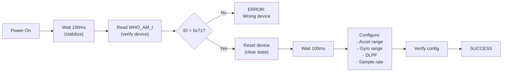
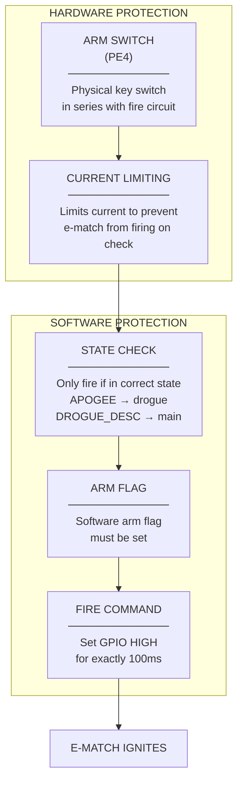

# Hardware Drivers

This page documents the low-level drivers for all sensors and peripherals on the flight computer. Each section explains not just how to use the driver, but why specific configurations were chosen and how to debug common issues.

---

## Driver Architecture

All drivers follow a consistent pattern:

```c
// 1. Handle structure holds all state
typedef struct {
    I2C_HandleTypeDef *hi2c;  // HAL handle
    uint8_t addr;              // Device address
    bool initialized;          // Init successful?
    // ... device-specific data
} SensorName_Handle_t;

// 2. Init function configures the device
HAL_StatusTypeDef SensorName_Init(SensorName_Handle_t *handle, ...);

// 3. Read function gets data
HAL_StatusTypeDef SensorName_Read(SensorName_Handle_t *handle);

// 4. Helper functions for specific data
float SensorName_GetSomeValue(SensorName_Handle_t *handle);
```

### Why This Pattern?

1. **Handle contains all state**: No global variables. You could run two of the same sensor.
2. **Init returns status**: You know immediately if the device is present and working.
3. **Consistent naming**: Easy to learn one driver, understand them all.

---

## Driver Summary

| Driver | Hardware | Interface | I2C Address | Update Rate |
|--------|----------|-----------|-------------|-------------|
| MPU9250 | InvenSense MPU-9250 | I2C1 | 0x68 | 100 Hz |
| BNO055 | Bosch BNO055 | I2C2 | 0x28 | 100 Hz |
| BMP380 | Bosch BMP380 | I2C1 | 0x77 | 50 Hz |
| MS5611 | TE MS5611 | I2C1 | 0x76 | 50 Hz |
| NEO7M | u-blox NEO-7M | UART2 | - | 1 Hz |
| E32 | EBYTE E32-433T30D | UART3 | - | On demand |
| W25Q | Winbond W25Q40 | SPI1 | - | On demand |
| Pyro | IRFU120 MOSFET | GPIO | - | - |

---

## MPU9250 (Primary IMU)

The MPU9250 is a 9-axis motion tracking device containing:
- 3-axis accelerometer (measures linear acceleration)
- 3-axis gyroscope (measures rotational velocity)
- 3-axis magnetometer (measures magnetic field)

### Why MPU9250?

| Reason | Explanation |
|--------|-------------|
| **Industry standard** | Used in countless drones and flight controllers |
| **Well-documented** | Register map is publicly available |
| **Affordable** | ~$5 for a module |
| **Flexible ranges** | Accel: ±2/4/8/16g, Gyro: ±250/500/1000/2000°/s |

### Configuration Choices

| Parameter | Value | Why |
|-----------|-------|-----|
| Accel Range | ±16g | Rocket experiences 5-8g at launch. Need headroom. |
| Gyro Range | ±2000°/s | Rockets can spin fast after burnout |
| DLPF | 41Hz | Motors vibrate at ~100-500Hz. Filter that out. |
| Sample Rate | 100Hz | Matches main loop. No point sampling faster. |

### Initialization Sequence



### Register Map (Key Registers)

| Register | Address | Description |
|----------|---------|-------------|
| WHO_AM_I | 0x75 | Device ID (should read 0x71) |
| PWR_MGMT_1 | 0x6B | Power management (write 0x80 to reset) |
| CONFIG | 0x1A | DLPF setting |
| GYRO_CONFIG | 0x1B | Gyroscope full-scale range |
| ACCEL_CONFIG | 0x1C | Accelerometer full-scale range |
| ACCEL_XOUT_H | 0x3B | Start of accel data (6 bytes) |
| GYRO_XOUT_H | 0x43 | Start of gyro data (6 bytes) |

### Code: Initialization

```c
HAL_StatusTypeDef MPU9250_Init(MPU9250_Handle_t *handle, 
                               I2C_HandleTypeDef *hi2c,
                               MPU9250_AccelFS_t accel_fs,
                               MPU9250_GyroFS_t gyro_fs) {
    handle->hi2c = hi2c;
    handle->addr = 0x68 << 1;  // I2C uses 8-bit address
    
    // 1. Wait for device to stabilize after power-on
    HAL_Delay(100);
    
    // 2. Check WHO_AM_I register
    uint8_t who_am_i;
    if (HAL_I2C_Mem_Read(hi2c, handle->addr, 0x75, 1, &who_am_i, 1, 100) != HAL_OK) {
        return HAL_ERROR;  // I2C communication failed
    }
    if (who_am_i != 0x71) {
        return HAL_ERROR;  // Wrong device
    }
    
    // 3. Reset device to clear any previous state
    uint8_t reset = 0x80;
    HAL_I2C_Mem_Write(hi2c, handle->addr, 0x6B, 1, &reset, 1, 100);
    HAL_Delay(100);  // Wait for reset
    
    // 4. Wake up (clear sleep bit)
    uint8_t wake = 0x00;
    HAL_I2C_Mem_Write(hi2c, handle->addr, 0x6B, 1, &wake, 1, 100);
    
    // 5. Configure DLPF (Digital Low-Pass Filter)
    // 0x03 = 41Hz bandwidth, 1kHz sample rate
    uint8_t config = 0x03;
    HAL_I2C_Mem_Write(hi2c, handle->addr, 0x1A, 1, &config, 1, 100);
    
    // 6. Configure accelerometer range
    uint8_t accel_config = (accel_fs << 3);
    HAL_I2C_Mem_Write(hi2c, handle->addr, 0x1C, 1, &accel_config, 1, 100);
    
    // 7. Configure gyroscope range
    uint8_t gyro_config = (gyro_fs << 3);
    HAL_I2C_Mem_Write(hi2c, handle->addr, 0x1B, 1, &gyro_config, 1, 100);
    
    // Store scale factors for later conversion
    handle->accel_scale = MPU9250_GetAccelScale(accel_fs);  // LSB/g
    handle->gyro_scale = MPU9250_GetGyroScale(gyro_fs);      // LSB/(°/s)
    
    handle->initialized = true;
    return HAL_OK;
}
```

### Code: Reading Data

```c
HAL_StatusTypeDef MPU9250_ReadAll(MPU9250_Handle_t *handle) {
    // Read 14 bytes starting from ACCEL_XOUT_H
    // Layout: AccelX(2) AccelY(2) AccelZ(2) Temp(2) GyroX(2) GyroY(2) GyroZ(2)
    uint8_t raw[14];
    
    if (HAL_I2C_Mem_Read(handle->hi2c, handle->addr, 0x3B, 1, raw, 14, 100) != HAL_OK) {
        return HAL_ERROR;
    }
    
    // Convert raw bytes to 16-bit signed integers (big-endian)
    int16_t accel_raw[3], gyro_raw[3];
    accel_raw[0] = (int16_t)((raw[0] << 8) | raw[1]);
    accel_raw[1] = (int16_t)((raw[2] << 8) | raw[3]);
    accel_raw[2] = (int16_t)((raw[4] << 8) | raw[5]);
    // raw[6-7] is temperature, skip for now
    gyro_raw[0] = (int16_t)((raw[8] << 8) | raw[9]);
    gyro_raw[1] = (int16_t)((raw[10] << 8) | raw[11]);
    gyro_raw[2] = (int16_t)((raw[12] << 8) | raw[13]);
    
    // Convert to physical units
    handle->accel.x = accel_raw[0] / handle->accel_scale;  // g
    handle->accel.y = accel_raw[1] / handle->accel_scale;
    handle->accel.z = accel_raw[2] / handle->accel_scale;
    
    handle->gyro.x = gyro_raw[0] / handle->gyro_scale;    // deg/s
    handle->gyro.y = gyro_raw[1] / handle->gyro_scale;
    handle->gyro.z = gyro_raw[2] / handle->gyro_scale;
    
    return HAL_OK;
}
```

### Common Issues and Debugging

| Problem | Symptoms | Likely Cause | Solution |
|---------|----------|--------------|----------|
| **WHO_AM_I returns 0xFF** | Init fails | I2C pullups missing | Add 4.7k pullups to SCL/SDA |
| **WHO_AM_I returns 0x70** | Init fails | Knock-off chip | Some clones use different ID. Try accepting 0x70. |
| **Accel stuck at 0** | Always reads zero | Device in sleep mode | Make sure you clear sleep bit after reset |
| **Data has 50Hz ripple** | Periodic noise | Power supply noise | Add 100nF cap close to device |
| **Data spikes randomly** | Occasional garbage | I2C bus errors | Check bus speed, pullups, trace length |

---

## BNO055 (Backup IMU)

The BNO055 is a "smart" 9-axis sensor with a built-in microcontroller that does sensor fusion for you.

### Why BNO055 as Backup?

| Advantage | Explanation |
|-----------|-------------|
| **Built-in fusion** | Outputs quaternion/Euler directly |
| **Different manufacturer** | If InvenSense has a bug, Bosch might not |
| **Self-calibrating** | Automatically corrects for temperature, magnetic interference |
| **Redundancy** | If our Kalman filter has bugs, BNO055 gives independent orientation |

### Why Not BNO055 as Primary?

| Disadvantage | Explanation |
|--------------|-------------|
| **Slower raw output** | Only 100Hz vs MPU9250's potential 1kHz |
| **Black box fusion** | We can't tune or debug its internal filter |
| **Calibration quirks** | Needs to be moved in specific patterns to calibrate |

### Operating Modes

| Mode | What It Does | When to Use |
|------|--------------|-------------|
| **CONFIG** | Allow configuration | Startup only |
| **NDOF** | Full 9-DOF fusion | Normal operation |
| **IMU** | 6-DOF (no mag) | When magnetic interference present |
| **COMPASS** | Heading only | Not used |

### Initialization Sequence

```c
HAL_StatusTypeDef BNO055_Init(BNO055_Handle_t *handle, 
                              I2C_HandleTypeDef *hi2c,
                              uint8_t addr) {
    handle->hi2c = hi2c;
    handle->addr = addr << 1;
    
    // 1. Check chip ID
    uint8_t chip_id;
    HAL_I2C_Mem_Read(hi2c, handle->addr, 0x00, 1, &chip_id, 1, 100);
    if (chip_id != 0xA0) {
        return HAL_ERROR;  // Wrong device
    }
    
    // 2. Switch to config mode
    uint8_t config_mode = 0x00;
    HAL_I2C_Mem_Write(hi2c, handle->addr, 0x3D, 1, &config_mode, 1, 100);
    HAL_Delay(25);  // Mode switch takes time
    
    // 3. Reset
    uint8_t reset = 0x20;
    HAL_I2C_Mem_Write(hi2c, handle->addr, 0x3F, 1, &reset, 1, 100);
    HAL_Delay(650);  // Reset takes up to 650ms
    
    // 4. Set power mode to normal
    uint8_t power_mode = 0x00;
    HAL_I2C_Mem_Write(hi2c, handle->addr, 0x3E, 1, &power_mode, 1, 100);
    HAL_Delay(10);
    
    // 5. Set units (degrees, m/s², °C)
    uint8_t units = 0x00;  // Default is what we want
    HAL_I2C_Mem_Write(hi2c, handle->addr, 0x3B, 1, &units, 1, 100);
    
    // 6. Set to NDOF mode (full sensor fusion)
    uint8_t ndof_mode = 0x0C;
    HAL_I2C_Mem_Write(hi2c, handle->addr, 0x3D, 1, &ndof_mode, 1, 100);
    HAL_Delay(20);
    
    handle->initialized = true;
    return HAL_OK;
}
```

### Calibration

The BNO055 requires calibration before orientation is accurate:

| Sensor | How to Calibrate |
|--------|-----------------|
| **Gyroscope** | Keep still for ~3 seconds |
| **Accelerometer** | Place in 6 different orientations |
| **Magnetometer** | Draw figure-8 pattern in air |

**Checking calibration status:**
```c
uint8_t BNO055_GetCalibrationStatus(BNO055_Handle_t *handle) {
    uint8_t calib;
    HAL_I2C_Mem_Read(handle->hi2c, handle->addr, 0x35, 1, &calib, 1, 100);
    
    // calib byte format: [SYS:2][GYR:2][ACC:2][MAG:2]
    // Each field: 0=not calibrated, 3=fully calibrated
    return calib;
}

bool BNO055_IsCalibrated(BNO055_Handle_t *handle) {
    uint8_t calib = BNO055_GetCalibrationStatus(handle);
    // Check if system calibration is at least 1 (partially calibrated)
    return ((calib >> 6) & 0x03) >= 1;
}
```

**Saving calibration:**
```c
// Once calibrated, read the calibration data
uint8_t calib_data[22];
HAL_I2C_Mem_Read(hi2c, addr, 0x55, 1, calib_data, 22, 100);
// Save calib_data to flash

// On next boot, restore it
HAL_I2C_Mem_Write(hi2c, addr, 0x55, 1, saved_calib_data, 22, 100);
```

---

## BMP380 (Primary Barometer)

High-precision digital pressure sensor for altitude measurement.

### Why BMP380?

| Feature | Benefit |
|---------|---------|
| **0.5 Pa RMS noise** | ~4cm altitude resolution |
| **High sample rate** | Up to 200Hz |
| **Built-in temperature** | Temperature compensation |
| **IIR filter** | Reduces noise without software effort |

### How Barometric Altitude Works

Air pressure decreases with altitude. The relationship is:

$$
P = P_0 \left(1 - \frac{L \cdot h}{T_0}\right)^{\frac{g \cdot M}{R \cdot L}}
$$

Where:
- $P$ = Pressure at altitude $h$
- $P_0$ = Sea-level pressure (typically 101325 Pa)
- $L$ = Temperature lapse rate (0.0065 K/m)
- $T_0$ = Sea-level temperature (288.15 K)
- $g$ = Gravitational acceleration (9.807 m/s²)
- $M$ = Molar mass of air (0.0289644 kg/mol)
- $R$ = Universal gas constant (8.31447 J/(mol·K))

Simplified formula (good up to ~11km):

$$
h = 44330 \times \left(1 - \left(\frac{P}{P_0}\right)^{0.1903}\right)
$$

### Configuration

| Parameter | Value | Why |
|-----------|-------|-----|
| **Oversampling (pressure)** | x8 | Reduces noise to acceptable level |
| **Oversampling (temp)** | x1 | Temperature changes slowly |
| **IIR Filter Coefficient** | 3 | Smooths out wind gusts |
| **Output Data Rate** | 50 Hz | Matches our fusion rate |

### Code: Initialization

```c
HAL_StatusTypeDef BMP380_Init(BMP380_Handle_t *handle,
                              I2C_HandleTypeDef *hi2c,
                              uint8_t addr) {
    handle->hi2c = hi2c;
    handle->addr = addr << 1;
    
    // 1. Check chip ID
    uint8_t chip_id;
    HAL_I2C_Mem_Read(hi2c, handle->addr, 0x00, 1, &chip_id, 1, 100);
    if (chip_id != 0x50) {  // BMP380 ID
        return HAL_ERROR;
    }
    
    // 2. Soft reset
    uint8_t reset_cmd = 0xB6;
    HAL_I2C_Mem_Write(hi2c, handle->addr, 0x7E, 1, &reset_cmd, 1, 100);
    HAL_Delay(10);
    
    // 3. Read calibration data (stored in sensor PROM)
    uint8_t calib[21];
    HAL_I2C_Mem_Read(hi2c, handle->addr, 0x31, 1, calib, 21, 100);
    BMP380_ParseCalibration(handle, calib);  // Store calibration coefficients
    
    // 4. Configure oversampling and filter
    // OSR_P = x8 (011), OSR_T = x1 (000)
    uint8_t osr = 0x03;
    HAL_I2C_Mem_Write(hi2c, handle->addr, 0x1C, 1, &osr, 1, 100);
    
    // IIR filter coefficient = 3
    uint8_t config = 0x04;
    HAL_I2C_Mem_Write(hi2c, handle->addr, 0x1F, 1, &config, 1, 100);
    
    // 5. Set to normal mode (continuous measurement)
    uint8_t pwr_ctrl = 0x33;  // Press_en + Temp_en + Normal mode
    HAL_I2C_Mem_Write(hi2c, handle->addr, 0x1B, 1, &pwr_ctrl, 1, 100);
    
    handle->initialized = true;
    return HAL_OK;
}
```

### Code: Reading and Converting

```c
HAL_StatusTypeDef BMP380_ReadData(BMP380_Handle_t *handle) {
    // Read raw pressure and temperature (6 bytes)
    uint8_t raw[6];
    HAL_I2C_Mem_Read(handle->hi2c, handle->addr, 0x04, 1, raw, 6, 100);
    
    // Combine bytes (24-bit values, little-endian)
    int32_t raw_pressure = (raw[2] << 16) | (raw[1] << 8) | raw[0];
    int32_t raw_temp = (raw[5] << 16) | (raw[4] << 8) | raw[3];
    
    // Compensate using calibration (complex formulas from datasheet)
    handle->temperature = BMP380_CompensateTemp(handle, raw_temp);
    handle->pressure = BMP380_CompensatePressure(handle, raw_pressure);
    
    return HAL_OK;
}

float BMP380_GetAltitude(BMP380_Handle_t *handle) {
    // Simplified barometric formula
    float ratio = handle->pressure / handle->sea_level_pressure;
    return 44330.0f * (1.0f - powf(ratio, 0.1903f));
}
```

### Ground Reference

Before launch, we calibrate the "sea level pressure" so altitude reads zero:

```c
void BMP380_CalibrateGround(BMP380_Handle_t *handle) {
    // Take 100 samples over 2 seconds
    float sum = 0;
    for (int i = 0; i < 100; i++) {
        BMP380_ReadData(handle);
        sum += handle->pressure;
        HAL_Delay(20);
    }
    
    // Average becomes our reference
    handle->sea_level_pressure = sum / 100.0f;
    // Now BMP380_GetAltitude() returns 0 at this location
}
```

---

## MS5611 (Backup Barometer)

High-resolution barometer from a different manufacturer (TE Connectivity).

### Why Two Barometers from Different Manufacturers?

If Bosch has a bug in their calibration algorithm, or a batch of BMP380s has a defect, the MS5611 provides an independent check.

### Key Difference from BMP380

The MS5611 uses a **command-based** interface instead of register-based:

| Command | Description |
|---------|-------------|
| 0x1E | Reset |
| 0xA0-0xAE | Read calibration PROM (7 values) |
| 0x48 | Start temperature conversion (OSR=4096) |
| 0x58 | Start pressure conversion (OSR=4096) |
| 0x00 | Read ADC result |

### Why Command-Based Matters

You can't just read a register. You must:
1. Send "convert temperature" command
2. Wait 9ms for conversion
3. Send "read ADC" command
4. Read 3 bytes

This makes the MS5611 **slower** than the BMP380 but potentially **more accurate** at high OSR.

### Second-Order Temperature Compensation

The MS5611 needs correction at extreme temperatures:

```c
void MS5611_Compensate(MS5611_Handle_t *handle, int32_t dT, int32_t raw_temp) {
    // First order compensation
    int64_t OFF = ((int64_t)handle->C[2] << 16) + 
                  (((int64_t)handle->C[4] * dT) >> 7);
    int64_t SENS = ((int64_t)handle->C[1] << 15) + 
                   (((int64_t)handle->C[3] * dT) >> 8);
    
    // Second order compensation (for T < 20°C)
    if (raw_temp < 2000) {
        int64_t T2 = (dT * dT) >> 31;
        int64_t OFF2 = 5 * ((raw_temp - 2000) * (raw_temp - 2000)) >> 1;
        int64_t SENS2 = OFF2 >> 1;
        
        // Extra compensation for T < -15°C
        if (raw_temp < -1500) {
            OFF2 += 7 * ((raw_temp + 1500) * (raw_temp + 1500));
            SENS2 += 11 * ((raw_temp + 1500) * (raw_temp + 1500)) >> 1;
        }
        
        OFF -= OFF2;
        SENS -= SENS2;
    }
    
    handle->OFF = OFF;
    handle->SENS = SENS;
}
```

---

## NEO-7M (GPS)

u-blox GPS receiver providing position for recovery.

### What We Use GPS For

| Purpose | Priority |
|---------|----------|
| **Recovery location** | Critical - find the rocket after landing |
| **Launch site reference** | Useful - automatic ground altitude |
| **Velocity check** | Backup - sanity check for Kalman filter |
| **Altitude** | Not used - barometer is more accurate |

### NMEA Protocol

The GPS outputs human-readable sentences. Here's the GPGGA sentence format:

**Example:** `$GPGGA,123519,4807.038,N,01131.000,E,1,08,0.9,545.4,M,47.0,M,,*47`

| Field | Position | Example | Description |
|-------|----------|---------|-------------|
| Sentence ID | 1 | `$GPGGA` | GPS fix data identifier |
| UTC Time | 2 | `123519` | 12:35:19 UTC |
| Latitude | 3-4 | `4807.038,N` | 48° 07.038' North |
| Longitude | 5-6 | `01131.000,E` | 11° 31.000' East |
| Fix Quality | 7 | `1` | 0=invalid, 1=GPS, 2=DGPS |
| Satellites | 8 | `08` | Number of satellites tracked |
| HDOP | 9 | `0.9` | Horizontal dilution of precision |
| Altitude | 10-11 | `545.4,M` | Altitude in meters |
| Checksum | last | `*47` | XOR checksum |

### Parsing NMEA

```c
void NEO7M_ParseGGA(NEO7M_Handle_t *gps, char *sentence) {
    char *token = strtok(sentence, ",");
    int field = 0;
    
    while (token != NULL) {
        switch (field) {
            case 1:  // Time
                // Format: HHMMSS.ss
                gps->time_utc = atof(token);
                break;
            case 2:  // Latitude
                // Format: DDMM.MMMM
                gps->latitude = NEO7M_ParseCoord(token);
                break;
            case 3:  // N/S
                if (token[0] == 'S') gps->latitude = -gps->latitude;
                break;
            case 4:  // Longitude
                gps->longitude = NEO7M_ParseCoord(token);
                break;
            case 5:  // E/W
                if (token[0] == 'W') gps->longitude = -gps->longitude;
                break;
            case 6:  // Fix quality
                gps->fix_quality = atoi(token);
                break;
            case 7:  // Satellites
                gps->satellites = atoi(token);
                break;
            case 9:  // Altitude
                gps->altitude_msl = atof(token);
                break;
        }
        token = strtok(NULL, ",");
        field++;
    }
}
```

### GPS Tips

1. **First fix takes time**: Cold start can take 30-60 seconds
2. **Need clear sky view**: GPS doesn't work indoors
3. **Update rate is 1Hz by default**: Don't try to read faster
4. **Accuracy varies**: 2.5m CEP typical, can be 10m+ in poor conditions

---

## E32-433T30D (LoRa Radio)

Long-range UART-based radio transceiver.

### Why LoRa?

| Feature | Benefit |
|---------|---------|
| **8km range** | Plenty for high-power rockets |
| **1W output** | Punches through interference |
| **Simple UART interface** | Just send bytes |
| **License-free** | 433MHz ISM band (check local regulations) |

### Mode Pins

The E32 has two mode pins (M0, M1) that select operating mode:

| M1 | M0 | Mode | Description |
|----|----|------|-------------|
| 0 | 0 | Normal | Transmit and receive |
| 0 | 1 | Wake-up | Low-power listening |
| 1 | 0 | Power-saving | Very low power |
| 1 | 1 | Sleep/Config | Configuration mode |

**Important:** You must wait 1ms after changing modes before sending data!

### Sending Data

```c
HAL_StatusTypeDef E32_Send(E32_Handle_t *handle, uint8_t *data, uint16_t len) {
    // Make sure we're in normal mode
    E32_SetMode(handle, E32_MODE_NORMAL);
    HAL_Delay(2);  // Wait for mode change
    
    // Send data via UART
    return HAL_UART_Transmit(handle->huart, data, len, 1000);
}
```

### AUX Pin

The AUX pin indicates module status:
- **Low during TX**: Module is transmitting
- **Low during config**: Module is processing config
- **High when idle**: Ready for commands

```c
bool E32_IsBusy(E32_Handle_t *handle) {
    return HAL_GPIO_ReadPin(handle->aux_port, handle->aux_pin) == GPIO_PIN_RESET;
}

void E32_WaitReady(E32_Handle_t *handle) {
    while (E32_IsBusy(handle)) {
        HAL_Delay(1);
    }
}
```

---

## W25Q40 (Flash Memory)

512KB SPI flash for black-box data logging.

### Why SPI Flash?

| Reason | Explanation |
|--------|-------------|
| **Fast** | 18MHz SPI, ~2MB/s read speed |
| **Reliable** | 100,000 erase cycles, 20-year data retention |
| **Simple** | Standard commands, no filesystem needed |
| **Non-volatile** | Data survives power loss |

### Key Operations

| Command | Opcode | Description |
|---------|--------|-------------|
| Read Data | 0x03 | Read any number of bytes |
| Page Program | 0x02 | Write up to 256 bytes |
| Sector Erase | 0x20 | Erase 4KB sector |
| Write Enable | 0x06 | Must call before any write |
| Read Status | 0x05 | Check if busy |

### Important Constraints

1. **Must erase before writing**: Write can only change 1→0. Erase sets all bits to 1.
2. **Page boundary**: Cannot write across 256-byte page boundaries.
3. **Minimum erase is 4KB**: Even to change 1 byte, you must erase entire sector.
4. **Write takes time**: Page program ~3ms, sector erase ~50ms.

### Code: Basic Operations

```c
void W25Q_SectorErase(W25Q_Handle_t *flash, uint32_t addr) {
    W25Q_WriteEnable(flash);
    
    uint8_t cmd[4] = {
        0x20,                   // Sector erase command
        (addr >> 16) & 0xFF,    // Address byte 2
        (addr >> 8) & 0xFF,     // Address byte 1
        addr & 0xFF             // Address byte 0
    };
    
    HAL_GPIO_WritePin(flash->cs_port, flash->cs_pin, GPIO_PIN_RESET);
    HAL_SPI_Transmit(flash->hspi, cmd, 4, 100);
    HAL_GPIO_WritePin(flash->cs_port, flash->cs_pin, GPIO_PIN_SET);
    
    W25Q_WaitBusy(flash);  // Takes ~50ms
}

void W25Q_PageProgram(W25Q_Handle_t *flash, uint32_t addr, uint8_t *data, uint16_t len) {
    if (len > 256) len = 256;  // Max page size
    
    W25Q_WriteEnable(flash);
    
    uint8_t cmd[4] = {
        0x02,                   // Page program command
        (addr >> 16) & 0xFF,
        (addr >> 8) & 0xFF,
        addr & 0xFF
    };
    
    HAL_GPIO_WritePin(flash->cs_port, flash->cs_pin, GPIO_PIN_RESET);
    HAL_SPI_Transmit(flash->hspi, cmd, 4, 100);
    HAL_SPI_Transmit(flash->hspi, data, len, 100);
    HAL_GPIO_WritePin(flash->cs_port, flash->cs_pin, GPIO_PIN_SET);
    
    W25Q_WaitBusy(flash);  // Takes ~3ms
}
```

---

## Pyro Controller

MOSFET-driven e-match ignition for parachute deployment.

### Safety Philosophy

Pyro firing is **safety-critical**. An accidental fire could:
- Deploy parachute on the pad (dangerous to ground crew)
- Not deploy when needed (rocket ballistic)
- Fire during boost (catastrophic)

We use **defense in depth**:



### Continuity Check

Before launch, we verify e-matches are connected:

```c
bool Pyro_CheckContinuity(Pyro_Handle_t *pyro, uint8_t channel) {
    // Read ADC on continuity pin
    // Circuit: 3.3V --- 10k --- [e-match] --- sense_pin --- 10k --- GND
    // With e-match: voltage divider, sense_pin ≈ 1.5V
    // Without e-match: floating or pulled to rail
    
    uint16_t adc_value = HAL_ADC_GetValue(&hadc);
    float voltage = (adc_value / 4096.0f) * 3.3f;
    
    // E-match resistance is typically 1-2 ohms
    // With 10k resistors, we expect ~1.5V ± 0.3V
    return (voltage > 1.2f && voltage < 1.8f);
}
```

---

### Fire Sequence

```c
HAL_StatusTypeDef Pyro_Fire(Pyro_Handle_t *pyro, uint8_t channel) {
    // 1. Check arm switch
    if (!Pyro_IsArmSwitchActive(pyro)) {
        return HAL_ERROR;
    }
    
    // 2. Check software arm
    if (!pyro->armed) {
        return HAL_ERROR;
    }
    
    // 3. Check correct state
    FlightState_t state = FSM_GetCurrentState();
    if (channel == PYRO_CHANNEL_DROGUE && state != FLIGHT_STATE_APOGEE) {
        return HAL_ERROR;
    }
    if (channel == PYRO_CHANNEL_MAIN && state != FLIGHT_STATE_DROGUE_DESCENT) {
        return HAL_ERROR;
    }
    
    // 4. Fire!
    GPIO_PinState fire_pin = pyro->channels[channel].fire_pin;
    HAL_GPIO_WritePin(pyro->gpio_port, fire_pin, GPIO_PIN_SET);
    
    // 5. Start shutoff timer
    pyro->channels[channel].fire_time = HAL_GetTick();
    pyro->channels[channel].firing = true;
    
    return HAL_OK;
}

void Pyro_Update(Pyro_Handle_t *pyro) {
    // Called every loop iteration
    // Auto-shutoff after 100ms (prevents burning MOSFET or draining battery)
    for (int i = 0; i < PYRO_NUM_CHANNELS; i++) {
        if (pyro->channels[i].firing) {
            if (HAL_GetTick() - pyro->channels[i].fire_time > 100) {
                HAL_GPIO_WritePin(pyro->gpio_port, 
                                  pyro->channels[i].fire_pin, 
                                  GPIO_PIN_RESET);
                pyro->channels[i].firing = false;
                pyro->channels[i].fired = true;  // Record that we fired
            }
        }
    }
}
