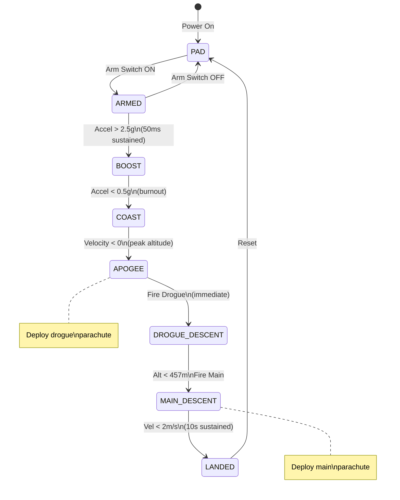

# Flight State Machine

The flight state machine is the brain of the avionics system. It enforces the correct sequence of events during flight and prevents dangerous conditions like firing the main parachute on the launchpad.

---

## Why a State Machine?

A rocket flight follows a strict sequence of phases. Each phase has different requirements:

| Phase | What's Happening | What We Need |
|-------|------------------|--------------|
| **Pad** | Rocket sitting on rail | Don't fire anything! |
| **Armed** | Ready for launch | Listen for acceleration |
| **Boost** | Motor burning | Wait for burnout |
| **Coast** | Flying upward, no thrust | Detect apogee |
| **Apogee** | Peak altitude | Fire drogue immediately |
| **Drogue Descent** | Falling slowly | Wait for main altitude |
| **Main Descent** | Under main chute | Wait for landing |
| **Landed** | On the ground | Transmit location |

A state machine ensures we **never skip a step**. You can't go from PAD directly to APOGEE. You can't fire the main chute during boost. Each transition requires specific conditions to be met.

### What Could Go Wrong Without It?

**Scenario 1: False Launch Detection**
Without proper state sequencing, a bump while loading the rocket could trigger "apogee detection" and fire the drogue on the pad.

**Scenario 2: Early Main Deployment**
If we fired main at apogee (3000m), the shock of the fast-moving rocket hitting a large parachute could destroy the rocket or rip the parachute.

**Scenario 3: Missed Apogee**
If we only used altitude for apogee detection (waiting for altitude to start decreasing), noise could cause premature detection during boost.

---

## State Diagram



---

## States In Detail

### PAD State

**What's happening:** Rocket is on the launch rail, possibly being handled by crew.

**Why this state exists:** We need a safe state where nothing can fire accidentally. Even if sensors malfunction, the pyros are physically locked out.

**Entry:** Power-on or manual reset  
**Exit:** Arm switch is turned ON

**Safety features:**
- Pyro circuits are disabled at hardware level (arm switch is in series with fire circuit)
- Telemetry transmits at 1Hz (conserving power)
- Continuous sensor health checks running

```c
case FLIGHT_STATE_PAD:
    // Check all systems
    if (HAL_GetTick() - last_health_check >= 1000) {
        CheckSensorHealth();
        CheckPyroContinuity();
        last_health_check = HAL_GetTick();
    }
    
    // Only transition if arm switch is on
    if (IsArmSwitchActive()) {
        TransitionTo(FLIGHT_STATE_ARMED);
    }
    break;
```

### ARMED State

**What's happening:** Launch imminent. All systems verified. Crew is clear of the pad.

**Why this state exists:** This is the "ready" state. We're actively looking for launch but haven't committed yet. Turning off the arm switch returns us to PAD.

**Entry:** Arm switch activated  
**Exit:** Launch detected (high acceleration) or arm switch turned off

**What we're looking for:** Sustained acceleration above 2.5g for 50ms.

```c
case FLIGHT_STATE_ARMED:
    // Allow return to PAD if arm switch is turned off
    if (!IsArmSwitchActive()) {
        TransitionTo(FLIGHT_STATE_PAD);
        launch_detect_count = 0;
        break;
    }
    
    // Launch detection with debouncing
    float accel_magnitude = sqrtf(accel_x*accel_x + accel_y*accel_y + accel_z*accel_z);
    
    if (accel_magnitude > config.launch_accel_threshold) {  // > 2.5g (24.5 m/s²)
        launch_detect_count++;
        if (launch_detect_count >= config.launch_detect_samples) {  // 5 samples = 50ms
            TransitionTo(FLIGHT_STATE_BOOST);
            launch_time = HAL_GetTick();
            LogEvent(EVENT_LAUNCH, accel_magnitude);
        }
    } else {
        launch_detect_count = 0;  // Reset counter if acceleration drops
    }
    break;
```

**Why 2.5g threshold?**
- Walking while carrying the rocket: ~1.2g
- Rough handling: ~2g
- Typical rocket launch: 4-10g

2.5g is high enough to reject handling but low enough to catch any realistic launch.

**Why 50ms debouncing?**
- Single spike from electrical noise: ~1ms
- Bump from dropping something: ~20ms
- Sustained motor burn: 2000-5000ms

50ms ensures we see real sustained thrust, not noise.

### BOOST State

**What's happening:** Motor is burning. Rocket is accelerating upward.

**Why this state exists:** We need to wait for motor burnout before looking for apogee. During boost, the rocket accelerates upward, so velocity is increasing. "Apogee" (velocity = 0) is impossible here.

**Entry:** Launch detected  
**Exit:** Acceleration drops below 0.5g (burnout) or timeout (10s)

```c
case FLIGHT_STATE_BOOST:
    // Safety timeout: If we've been in boost for > 10 seconds, something is wrong
    if (HAL_GetTick() - launch_time > config.max_boost_time) {
        TransitionTo(FLIGHT_STATE_COAST);
        LogEvent(EVENT_BOOST_TIMEOUT, 0);
        break;
    }
    
    // Normal burnout detection
    float vertical_accel = GetVerticalAcceleration();
    
    if (vertical_accel < config.burnout_threshold) {  // < 0.5g (4.9 m/s²)
        burnout_count++;
        if (burnout_count >= config.burnout_samples) {  // 3 samples = 30ms
            TransitionTo(FLIGHT_STATE_COAST);
            burnout_time = HAL_GetTick();
            LogEvent(EVENT_BURNOUT, vertical_accel);
        }
    } else {
        burnout_count = 0;
    }
    
    // Track max values
    if (velocity > max_velocity) max_velocity = velocity;
    if (altitude > max_altitude) max_altitude = altitude;
    break;
```

**Why 0.5g threshold?**
During coast, the rocket is in near-freefall with only drag acting on it. The accelerometer reads:

$$a_{measured} = a_{actual} - g_{gravity}$$

In true freefall, $a_{measured} = 0$. With drag slowing us down, we might see 0.3-0.5g. Anything above 0.5g suggests thrust is still present.

**Why the 10-second timeout?**
The longest hobby rocket motors burn for ~6 seconds (O-class). If we're still in "boost" after 10 seconds, something is wrong (sensor stuck, software bug). The timeout forces a transition to coast, ensuring we eventually detect apogee.

### COAST State

**What's happening:** Motor has burned out. Rocket is coasting upward, slowing down due to gravity and drag.

**Why this state exists:** This is where apogee detection happens. We're watching velocity to determine when we've reached peak altitude.

**Entry:** Burnout detected  
**Exit:** Velocity crosses zero (apogee) or timeout (60s)

```c
case FLIGHT_STATE_COAST:
    // Safety timeout
    if (HAL_GetTick() - burnout_time > config.max_coast_time) {
        TransitionTo(FLIGHT_STATE_APOGEE);
        LogEvent(EVENT_COAST_TIMEOUT, 0);
        FireDrogue();  // Fire anyway for safety
        break;
    }
    
    // Apogee lockout: Ignore for first 3 seconds after burnout
    // This prevents false apogee from motor burnout transients
    if (HAL_GetTick() - burnout_time < config.apogee_lockout) {
        break;
    }
    
    // PRIMARY: Velocity-based detection
    if (velocity < config.apogee_velocity_threshold) {  // < 2 m/s
        apogee_count++;
        if (apogee_count >= config.apogee_samples) {  // 3 samples
            TransitionTo(FLIGHT_STATE_APOGEE);
            apogee_time = HAL_GetTick();
            apogee_altitude = altitude;
            LogEvent(EVENT_APOGEE, velocity);
            FireDrogue();
            break;
        }
    } else {
        apogee_count = 0;
    }
    
    // BACKUP: Altitude-based detection
    // If we're 50m below peak, we definitely passed apogee
    if (altitude < max_altitude - config.apogee_altitude_drop) {  // 50m
        TransitionTo(FLIGHT_STATE_APOGEE);
        LogEvent(EVENT_APOGEE_BACKUP, altitude);
        FireDrogue();
    }
    
    break;
```

**Why velocity-based detection?**
At apogee, the rocket momentarily stops. Velocity = 0. This is the most reliable indicator because:
1. It's physics-based (conservation of energy)
2. It happens at the exact moment of peak altitude
3. It's independent of absolute altitude errors

**Why the backup altitude method?**
Velocity is derived from integrating acceleration. Integration errors accumulate over time. If there's a bias in the accelerometer, the computed velocity might never cross zero. The altitude backup catches this case.

**Why 3-second lockout?**
When the motor burns out, there's often a brief spike or dip in acceleration from:
- Thrust termination transient
- Shock wave from motor nozzle
- Sudden change in drag profile

This could briefly make velocity appear to cross zero. The lockout ensures we're in stable coast before checking.

### APOGEE State

**What's happening:** Peak altitude reached. Drogue parachute fires immediately.

**Why this state exists:** This is a transitional state that exists long enough to fire the drogue and log the event. It immediately transitions to DROGUE_DESCENT.

**Entry:** Apogee detected (velocity ≤ 0 or altitude dropping)  
**Exit:** Immediately after drogue fires

```c
case FLIGHT_STATE_APOGEE:
    // This state exists only to fire the drogue
    // FireDrogue() was called during transition
    
    // Immediately move to descent
    TransitionTo(FLIGHT_STATE_DROGUE_DESCENT);
    break;
```

**Why fire immediately?**
Every second of delay means the rocket falls ~50m. Delayed deployment means:
1. Higher velocity at deployment = more stress on parachute
2. Less time under drogue before main altitude
3. Risk of tumbling/spinning makes deployment harder

### DROGUE_DESCENT State

**What's happening:** Falling under drogue parachute. Descent rate ~20-30 m/s.

**Why this state exists:** The drogue slows us down enough to prevent damage from the main parachute deployment. We wait until we're at a safe altitude to deploy main.

**Entry:** Drogue fired  
**Exit:** Altitude drops below 457m (1500ft) AGL

```c
case FLIGHT_STATE_DROGUE_DESCENT:
    // Main deployment at standard altitude
    if (altitude < config.main_deploy_altitude) {  // < 457m (1500ft)
        TransitionTo(FLIGHT_STATE_MAIN_DESCENT);
        main_time = HAL_GetTick();
        LogEvent(EVENT_MAIN, altitude);
        FireMain();
    }
    break;
```

**Why 457m (1500ft)?**
This is an industry standard for high-power rocketry:
- High enough to fully inflate the main (takes ~100m of fall)
- High enough to slow down before impact
- Low enough that wind won't carry you miles away
- Mandated by many launch site rules

**Why not deploy main at apogee?**
At apogee (e.g., 3000m), you might be traveling 100+ m/s. A main parachute opening at that speed would:
1. Experience 10-20x the designed load
2. Likely rip or pull apart attachment points
3. Cause a "zipper" (tear through the rocket body)

The drogue gets you down to 20-30 m/s, where main deployment is safe.

### MAIN_DESCENT State

**What's happening:** Falling under main parachute. Descent rate ~5-8 m/s.

**Why this state exists:** We need to detect landing to switch to recovery beacon mode.

**Entry:** Main fired  
**Exit:** Velocity < 2 m/s for 10 seconds

```c
case FLIGHT_STATE_MAIN_DESCENT:
    // Landing detection: velocity must be low for sustained period
    if (fabsf(velocity) < config.landed_velocity_threshold) {  // < 2 m/s
        landed_count++;
        if (landed_count >= config.landed_samples) {  // 1000 samples = 10 seconds
            TransitionTo(FLIGHT_STATE_LANDED);
            landed_time = HAL_GetTick();
            LogEvent(EVENT_LANDED, altitude);
        }
    } else {
        landed_count = 0;
    }
    break;
```

**Why 10 seconds of low velocity?**
- Under main chute, descent rate fluctuates ±2 m/s due to wind
- A brief ground contact during tumble could show low velocity
- 10 seconds of sustained low velocity confirms we're truly stationary

### LANDED State

**What's happening:** Rocket is on the ground. Transmitting location for recovery.

**Why this state exists:** Switches to power-saving mode while still transmitting enough data for recovery teams to find us.

**Entry:** Landing detected  
**Exit:** Manual reset or power cycle

```c
case FLIGHT_STATE_LANDED:
    // Reduce telemetry rate to conserve battery
    telemetry_interval = 5000;  // Every 5 seconds
    
    // Activate buzzer (if equipped) for audio location
    if (HAL_GetTick() - last_buzzer >= 30000) {  // Every 30 seconds
        ActivateBuzzer(500);  // 500ms beep
        last_buzzer = HAL_GetTick();
    }
    
    // Finalize flight data
    if (!flight_data_finalized) {
        WriteFlightHeader();
        flight_data_finalized = true;
    }
    break;
```

---

## Configuration Parameters

All thresholds are configurable. Here are the defaults with explanations:

| Parameter | Default | Unit | Why This Value |
|-----------|---------|------|----------------|
| `launch_accel_threshold` | 24.5 | m/s² | 2.5g - above handling, below any launch |
| `launch_detect_samples` | 5 | samples | 50ms at 100Hz - long enough to reject bumps |
| `burnout_threshold` | 4.9 | m/s² | 0.5g - below coast but allows for drag |
| `burnout_samples` | 3 | samples | 30ms - shorter since burnout is brief |
| `apogee_velocity_threshold` | 2.0 | m/s | Near zero, accounts for integration error |
| `apogee_samples` | 3 | samples | 30ms - fast detection critical at apogee |
| `apogee_altitude_drop` | 50.0 | m | Backup: if we're 50m below peak, we missed apogee |
| `apogee_lockout` | 3000 | ms | Ignore apogee for 3s after burnout |
| `main_deploy_altitude` | 457.0 | m | 1500ft AGL - industry standard |
| `landed_velocity_threshold` | 2.0 | m/s | Walking speed - definitely stopped |
| `landed_samples` | 1000 | samples | 10 seconds sustained |

---

## Safety Timeouts

Even if sensors fail, these timeouts ensure parachutes eventually deploy:

| Timeout | Duration | What It Catches |
|---------|----------|-----------------|
| **Max boost time** | 10s | Accelerometer stuck high |
| **Max coast time** | 60s | Velocity integration error (never reaches zero) |
| **Max descent time** | 300s | Altitude sensor stuck (never reaches main altitude) |
| **Apogee lockout** | 3s | Motor burnout transients |

### Timeout Logic Example

```c
// Coast timeout - fire drogue even if velocity never crosses zero
if (current_state == FLIGHT_STATE_COAST) {
    if (HAL_GetTick() - burnout_time > MAX_COAST_TIME_MS) {
        LogEvent(EVENT_COAST_TIMEOUT, 0);
        FireDrogue();
        TransitionTo(FLIGHT_STATE_DROGUE_DESCENT);
    }
}
```

---

## Example Flight Log

This is what a real flight log looks like, annotated:

```
[T+0.000s] BOOT: System initialized
           Sensors: IMU1:OK IMU2:OK BARO1:OK BARO2:OK GPS:3D_FIX
           Pyros: DRG:CONT MAIN:CONT (both e-matches connected)
           
[T+0.000s] State: BOOT -> PAD
           Entering safe state, waiting for arm switch

[T+5.231s] ARM SWITCH: Activated
[T+5.231s] State: PAD -> ARMED
           Now monitoring for launch acceleration

[T+12.445s] LAUNCH DETECTED
           Acceleration: 8.3g sustained for 52ms
           Trigger: 5 samples above 2.5g threshold
[T+12.445s] State: ARMED -> BOOST
           Motor burn in progress

[T+12.520s] (sample) Alt: 12m, Vel: 45 m/s, Accel: 8.1g
[T+13.000s] (sample) Alt: 156m, Vel: 142 m/s, Accel: 7.8g
[T+14.000s] (sample) Alt: 523m, Vel: 245 m/s, Accel: 7.2g
[T+15.500s] (sample) Alt: 1102m, Vel: 298 m/s, Accel: 0.8g

[T+15.892s] BURNOUT DETECTED
           Acceleration: 0.42g (below 0.5g threshold)
           Motor burn duration: 3.447s
[T+15.892s] State: BOOST -> COAST
           Entering 3-second apogee lockout

[T+18.892s] Apogee lockout ended, now monitoring velocity

[T+20.000s] (sample) Alt: 2845m, Vel: 89 m/s
[T+22.000s] (sample) Alt: 3156m, Vel: 42 m/s
[T+23.500s] (sample) Alt: 3241m, Vel: 12 m/s
[T+24.100s] (sample) Alt: 3248m, Vel: 1.2 m/s

[T+24.156s] APOGEE DETECTED
           Velocity: -0.2 m/s (crossed zero)
           Peak altitude: 3248.12m (10,656 ft)
[T+24.156s] State: COAST -> APOGEE
[T+24.156s] >>> FIRING DROGUE <<<
           Pyro 1 GPIO HIGH, pulse duration: 100ms

[T+24.157s] State: APOGEE -> DROGUE_DESCENT
           Drogue deployed, monitoring altitude for main

[T+30.000s] (sample) Alt: 2834m, Vel: -28 m/s (descent)
[T+35.000s] (sample) Alt: 2412m, Vel: -25 m/s
[T+40.000s] (sample) Alt: 1845m, Vel: -26 m/s
[T+45.000s] (sample) Alt: 485m, Vel: -24 m/s

[T+45.234s] MAIN ALTITUDE REACHED
           Altitude: 445m (below 457m threshold)
[T+45.234s] State: DROGUE_DESCENT -> MAIN_DESCENT
[T+45.234s] >>> FIRING MAIN <<<
           Pyro 2 GPIO HIGH, pulse duration: 100ms

[T+50.000s] (sample) Alt: 312m, Vel: -15 m/s (slowing)
[T+60.000s] (sample) Alt: 178m, Vel: -6 m/s
[T+80.000s] (sample) Alt: 45m, Vel: -5.5 m/s
[T+88.000s] (sample) Alt: 2m, Vel: -1.8 m/s

[T+88.445s] First landing indication (vel < 2 m/s)
[T+98.445s] LANDING CONFIRMED
           Velocity < 2 m/s sustained for 10.0 seconds
[T+98.445s] State: MAIN_DESCENT -> LANDED
           Flight complete, switching to recovery beacon mode

FLIGHT SUMMARY:
  Total time:   86.0 seconds
  Max altitude: 3248.12 m
  Max velocity: 312.5 m/s (Mach 0.92)
  Max accel:    8.3 g
  Landing GPS:  39.9156°N, 32.8734°E
```
