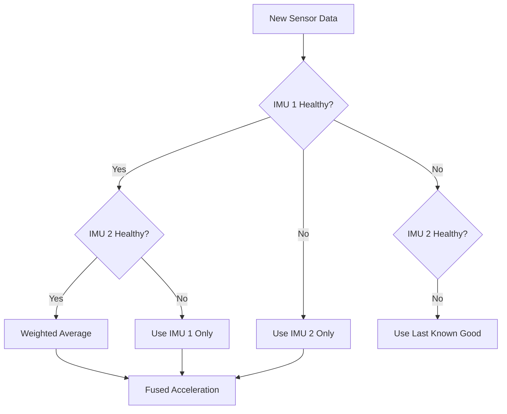

# Sensor Fusion

Sensor fusion is the process of combining data from multiple sensors to produce a more accurate estimate than any single sensor alone. This is the most mathematically complex part of our avionics system, but also the most important.

---

## Why Do We Need Sensor Fusion?

Imagine trying to measure your altitude with different tools:

### The Accelerometer Problem

An accelerometer measures acceleration directly. To get velocity and position, we integrate:

$$v(t) = \int a(t) \, dt$$

$$h(t) = \int v(t) \, dt$$

**The Problem: Integration accumulates errors.**

If our accelerometer has a tiny bias of 0.01 m/s² (barely noticeable), after 10 seconds:
- Velocity error: $0.01 \times 10 = 0.1$ m/s
- Position error: $0.5 \times 0.01 \times 10^2 = 0.5$ meters

After 60 seconds:
- Velocity error: 0.6 m/s
- Position error: **18 meters!**

This is called **drift**, and it's why you can't use an accelerometer alone for altitude.

### The Barometer Problem

A barometer measures air pressure, which we convert to altitude. No integration needed, so no drift!

**The Problem: Slow response and noise.**

| Issue | Cause |
|-------|-------|
| **Response lag** | Internal filtering takes 50-100ms |
| **Noise** | Pressure fluctuates ±0.5Pa (±4cm altitude) |
| **Weather drift** | Atmospheric pressure changes over hours |

If we fire the drogue based on barometer alone, we might be 50m past apogee by the time it registers.

### The Solution: Combine Both

| Sensor | Good At | Bad At |
|--------|---------|--------|
| **Accelerometer** | Fast response (1ms) | Drifts when integrated |
| **Barometer** | Absolute altitude | Slow, noisy |

We use the accelerometer to predict what's happening RIGHT NOW, then correct our prediction when the barometer catches up.

---

## The Kalman Filter: Intuition

Think of the Kalman filter as a skeptical scientist:

1. **Prediction**: "Based on physics, I expect the rocket to be at altitude X with velocity Y."

2. **Measurement**: "The barometer says altitude is Z."

3. **Update**: "The barometer is pretty reliable, so I'll adjust my estimate toward Z, but not all the way because it's also noisy."

The key insight: **how much we trust each source depends on how noisy it is.**

### A Simple Example

Imagine you're trying to estimate your car's speed:
- Your speedometer says 60 mph (but it has a ±5 mph error)
- Based on how much you've accelerated, you predict 62 mph (but acceleration sensors drift)

**How do you combine these?**

If the speedometer is more reliable, you weight it more heavily:

$$\text{best estimate} = 0.7 \times \text{speedometer} + 0.3 \times \text{prediction}$$

The Kalman filter does exactly this, but:
1. It calculates the optimal weights automatically
2. It updates those weights based on how well predictions match reality
3. It handles multiple variables simultaneously (altitude AND velocity)

---

## State Vector: What We're Tracking

We track two variables together:

$$
\mathbf{x} = \begin{bmatrix} h \\ v \end{bmatrix}
$$

Where:
- $h$ = Altitude above ground (meters)
- $v$ = Vertical velocity (m/s, positive = up)

**Why track both together?**

Because they're coupled by physics:
- Velocity changes altitude: $\frac{dh}{dt} = v$
- Acceleration changes velocity: $\frac{dv}{dt} = a$

The Kalman filter exploits this relationship to improve both estimates.

---

## Prediction Step: Using Physics

Every 10ms (100Hz), we use the accelerometer to predict the new state.

### The Physics Model

Given current altitude $h$, velocity $v$, and measured acceleration $a$:

$$h_{new} = h + v \cdot \Delta t + \frac{1}{2} a \cdot \Delta t^2$$

$$v_{new} = v + a \cdot \Delta t$$

### In Matrix Form

$$
\mathbf{x}_{k|k-1} = \mathbf{A} \mathbf{x}_{k-1} + \mathbf{B} u_k
$$

Where:

$$
\mathbf{A} = \begin{bmatrix} 1 & \Delta t \\ 0 & 1 \end{bmatrix}, \quad
\mathbf{B} = \begin{bmatrix} \frac{1}{2}\Delta t^2 \\ \Delta t \end{bmatrix}, \quad
u_k = a_z - g
$$

**Breaking this down:**

The **state transition matrix** $\mathbf{A}$:
- Row 1: $h_{new} = 1 \cdot h + \Delta t \cdot v$ (altitude = old altitude + velocity × time)
- Row 2: $v_{new} = 0 \cdot h + 1 \cdot v$ (velocity unchanged by this matrix)

The **control input matrix** $\mathbf{B}$:
- Describes how acceleration affects the state
- Note: we subtract gravity ($g$) from measured acceleration because the accelerometer measures "proper acceleration" (includes gravity when sitting still)

### Code Implementation

```c
void KF_Predict(KalmanFilter_t *kf, float accel, float dt) {
    // Remove gravity from measurement
    // When sitting still, accelerometer reads +9.81 m/s² (resisting gravity)
    // During freefall, it reads 0
    // We want actual acceleration, so: a_actual = a_measured - g
    float a = accel - 9.81f;
    
    // Physics update (standard kinematic equations)
    kf->x[0] += kf->x[1] * dt + 0.5f * a * dt * dt;  // h = h + v*t + 0.5*a*t²
    kf->x[1] += a * dt;                               // v = v + a*t
    
    // Update covariance (how uncertain we are)
    // P = A*P*A' + Q
    // This is the mathematical part that tracks our uncertainty
    float p00 = kf->P[0][0];
    float p01 = kf->P[0][1];
    float p10 = kf->P[1][0];
    float p11 = kf->P[1][1];
    
    // Covariance propagation
    kf->P[0][0] = p00 + dt * (p10 + p01 + dt * p11) + kf->Q[0][0];
    kf->P[0][1] = p01 + dt * p11;
    kf->P[1][0] = p10 + dt * p11;
    kf->P[1][1] = p11 + kf->Q[1][1];
}
```

### What's the Covariance Matrix P?

$\mathbf{P}$ tells us **how uncertain** we are about our state:

$$
\mathbf{P} = \begin{bmatrix} \sigma_h^2 & \sigma_{hv} \\ \sigma_{hv} & \sigma_v^2 \end{bmatrix}
$$

- $P[0][0]$: Variance of altitude estimate (how many meters off might we be?)
- $P[1][1]$: Variance of velocity estimate (how many m/s off might we be?)
- $P[0][1]$, $P[1][0]$: Covariance (if altitude is off high, is velocity likely off high too?)

During prediction, **uncertainty grows** because we're relying on a noisy accelerometer.

---

## Update Step: Incorporating Barometer Data

Every 20ms (50Hz), the barometer gives us a new altitude measurement. Time to correct our prediction!

### The Innovation

First, we calculate how far off our prediction was:

$$y = z_{baro} - h_{predicted}$$

This is called the **innovation** or **measurement residual**. If our prediction was perfect, $y = 0$.

### The Kalman Gain

The **Kalman gain** $\mathbf{K}$ decides how much to trust the new measurement:

$$
\mathbf{K} = \mathbf{P}_{k|k-1} \mathbf{H}^T (\mathbf{H} \mathbf{P}_{k|k-1} \mathbf{H}^T + R)^{-1}
$$

Where:
- $\mathbf{H} = \begin{bmatrix} 1 & 0 \end{bmatrix}$ (we only measure altitude, not velocity)
- $R$ = measurement noise variance (how noisy is the barometer?)

**Intuition:**
- If $R$ is large (noisy barometer), $K$ is small → we barely adjust our estimate
- If $P$ is large (uncertain prediction), $K$ is large → we trust the measurement more

### State Update

$$
\mathbf{x}_k = \mathbf{x}_{k|k-1} + \mathbf{K}(z_k - \mathbf{H} \mathbf{x}_{k|k-1})
$$

Or in simple terms:
- $h_{updated} = h_{predicted} + K_0 \cdot (z_{baro} - h_{predicted})$
- $v_{updated} = v_{predicted} + K_1 \cdot (z_{baro} - h_{predicted})$

**Note:** Even though we only measured altitude, we also update velocity! The Kalman filter is smart enough to know: "If my altitude prediction was off, my velocity might be off too."

### Covariance Update

$$
\mathbf{P}_k = (\mathbf{I} - \mathbf{K} \mathbf{H}) \mathbf{P}_{k|k-1}
$$

After incorporating the measurement, **our uncertainty decreases**.

### Code Implementation

```c
void KF_Update(KalmanFilter_t *kf, float baro_altitude) {
    // Innovation: how far off was our prediction?
    float y = baro_altitude - kf->x[0];
    
    // Innovation covariance: total uncertainty in the innovation
    // S = H*P*H' + R = P[0][0] + R (since H = [1, 0])
    float S = kf->P[0][0] + kf->R_baro;
    
    // Kalman gain: K = P*H'/S
    float K[2];
    K[0] = kf->P[0][0] / S;  // How much to correct altitude
    K[1] = kf->P[1][0] / S;  // How much to correct velocity
    
    // Update state estimate
    kf->x[0] += K[0] * y;  // Correct altitude
    kf->x[1] += K[1] * y;  // Correct velocity (even though we didn't measure it!)
    
    // Update covariance (uncertainty shrinks after measurement)
    float p00 = kf->P[0][0];
    float p01 = kf->P[0][1];
    
    kf->P[0][0] -= K[0] * p00;
    kf->P[0][1] -= K[0] * p01;
    kf->P[1][0] -= K[1] * p00;
    kf->P[1][1] -= K[1] * p01;
}
```

---

## Tuning Parameters

The Kalman filter has three main tuning knobs:

### Process Noise Q

**Q[0][0]**: How much can altitude change unexpectedly?

This accounts for:
- Accelerometer bias errors
- Model simplifications (we ignore drag)
- Numerical precision limits

Typical value: **0.1**

**Q[1][1]**: How much can velocity change unexpectedly?

Higher than altitude noise because acceleration integration is noisy.

Typical value: **1.0**

### Measurement Noise R

**R**: How noisy is the barometer?

From the BMP380 datasheet, RMS noise is about 0.5 Pa, which corresponds to ~4cm altitude.

But we also have:
- Pressure variations from wind
- Temperature-induced errors
- Conversion math approximations

Typical value: **2.0** (corresponds to ±1.4m standard deviation)

### Tuning Guidelines

| Symptom | Likely Problem | Fix |
|---------|----------------|-----|
| Output lags behind reality | Q too low (over-trusting accelerometer) | Increase Q |
| Output is jittery/noisy | R too low (over-trusting barometer) | Increase R |
| Velocity seems wrong | Q[1][1] too low | Increase Q[1][1] |
| Sudden jumps in output | R too low | Increase R |

**Tuning procedure:**
1. Start with high R (100), low Q (0.01)
2. Output will lag badly behind reality
3. Increase Q until lag is acceptable
4. Decrease R until noise is acceptable
5. Fine-tune based on flight test data

---

## Sensor Redundancy

We have **2 IMUs** and **2 barometers**. How do we combine them?

### Health Monitoring

Each sensor has a health score:

```c
typedef struct {
    bool available;        // Is data valid?
    uint32_t last_update;  // When did we last get good data?
    uint8_t error_count;   // Consecutive errors
    float confidence;      // 0.0 - 1.0
} SensorHealth_t;
```

A sensor is "healthy" if:
- It returned data in the last 100ms
- The data is within valid range
- Error count < 5

### Fusion Strategy



### Weighted Averaging Code

```c
float GetFusedAcceleration(SensorFusion_t *sf) {
    bool imu1_ok = sf->imu_health[0].available;
    bool imu2_ok = sf->imu_health[1].available;
    
    if (imu1_ok && imu2_ok) {
        // Both healthy: weighted average based on confidence
        float w1 = sf->imu_health[0].confidence;
        float w2 = sf->imu_health[1].confidence;
        float total = w1 + w2;
        
        return (w1 * sf->imu[0].accel_z + w2 * sf->imu[1].accel_z) / total;
        
    } else if (imu1_ok) {
        return sf->imu[0].accel_z;
        
    } else if (imu2_ok) {
        return sf->imu[1].accel_z;
        
    } else {
        // Both failed - this is very bad
        sf->error_flag = true;
        return 9.81f;  // Assume sitting still (1g)
    }
}
```

### Barometer Fusion

```c
float GetFusedBaroAltitude(SensorFusion_t *sf) {
    bool baro1_ok = sf->baro_health[0].available;
    bool baro2_ok = sf->baro_health[1].available;
    
    if (baro1_ok && baro2_ok) {
        // Sanity check: are they within 10m of each other?
        float diff = fabsf(sf->baro[0].altitude - sf->baro[1].altitude);
        
        if (diff > 10.0f) {
            // One is probably wrong - use the one closer to predicted
            float pred = sf->kf.x[0];
            float err1 = fabsf(sf->baro[0].altitude - pred);
            float err2 = fabsf(sf->baro[1].altitude - pred);
            
            return (err1 < err2) ? sf->baro[0].altitude : sf->baro[1].altitude;
        }
        
        // Both reasonable: average
        return 0.5f * (sf->baro[0].altitude + sf->baro[1].altitude);
        
    } else if (baro1_ok) {
        return sf->baro[0].altitude;
        
    } else if (baro2_ok) {
        return sf->baro[1].altitude;
        
    } else {
        // Both failed - cannot update Kalman filter with barometer
        // The prediction step will continue using accelerometer only
        return NAN;
    }
}
```

---

## Output Data

The fusion system produces a single, coherent view of the rocket's state:

```c
typedef struct {
    // Primary outputs (Kalman filtered)
    float altitude;         // meters AGL, filtered
    float velocity;         // m/s vertical, filtered (positive = up)
    float accel_vertical;   // m/s², gravity removed
    
    // Orientation (from BNO055 or computed)
    float roll;             // degrees
    float pitch;            // degrees
    float yaw;              // degrees
    
    // Confidence metrics
    float altitude_confidence;  // 0-1, higher = more certain
    float velocity_confidence;  // 0-1, higher = more certain
    
    // Source tracking
    uint8_t imu_source;         // 0=primary, 1=backup, 2=fused, 3=failed
    uint8_t baro_source;        // 0=primary, 1=backup, 2=fused, 3=failed
    
    // Raw sensor count (for debugging)
    uint8_t imu_count;          // How many IMUs are healthy
    uint8_t baro_count;         // How many baros are healthy
} Fused_Data_t;
```

---

## Worked Example

Let's trace through one iteration:

### Initial State
- $h = 1000$ m, $v = 50$ m/s
- $P = \begin{bmatrix} 1 & 0 \\ 0 & 2 \end{bmatrix}$
- Accelerometer reads: 12.5 m/s² (upward acceleration)
- $\Delta t = 0.01$ s (10ms)

### Prediction Step

1. Remove gravity: $a = 12.5 - 9.81 = 2.69$ m/s²

2. Update state:
   - $h = 1000 + 50 \times 0.01 + 0.5 \times 2.69 \times 0.01^2 = 1000.5001$ m
   - $v = 50 + 2.69 \times 0.01 = 50.0269$ m/s

3. Update covariance (simplified, assuming Q = [0.1, 1]):
   - Uncertainty grows slightly

### Update Step (every other cycle)

4. Barometer reads: 1001.2 m

5. Innovation: $y = 1001.2 - 1000.5 = 0.7$ m

6. Kalman gain (assuming R = 2):
   - $K_0 \approx 0.33$
   - $K_1 \approx 0.2$

7. Update state:
   - $h = 1000.5 + 0.33 \times 0.7 = 1000.73$ m
   - $v = 50.03 + 0.2 \times 0.7 = 50.17$ m/s

8. Result: Altitude moved toward barometer reading, velocity also adjusted slightly.

---

## Common Issues and Debugging

### Issue: Filter Diverges (Output Goes to Infinity)

**Cause:** Covariance matrix becomes non-positive-definite due to numerical errors.

**Fix:** Use the Joseph form covariance update:
```c
// More numerically stable version
// P = (I - KH) * P * (I - KH)' + K * R * K'
```

### Issue: Filter Ignores Barometer

**Cause:** Q is much larger than R, so the filter thinks accelerometer is gospel truth.

**Fix:** Reduce Q or increase R until barometer updates cause visible corrections.

### Issue: Altitude Drops During Motor Burn

**Cause:** Gravity removal assumes vertical orientation. During tilted boost, math is wrong.

**Fix:** Use orientation from BNO055 to rotate acceleration into vertical frame:
```c
float vertical_accel = accel_x * sin(pitch) + accel_z * cos(pitch);
```

### Issue: Velocity Drifts Over Time

**Cause:** Accelerometer bias not being corrected.

**Fix:** Zero-velocity updates when stationary (on pad):
```c
if (state == PAD && altitude_variance < 0.1f) {
    // We're stationary, velocity should be zero
    kf->x[1] = 0;  // Force velocity to zero
}
```
